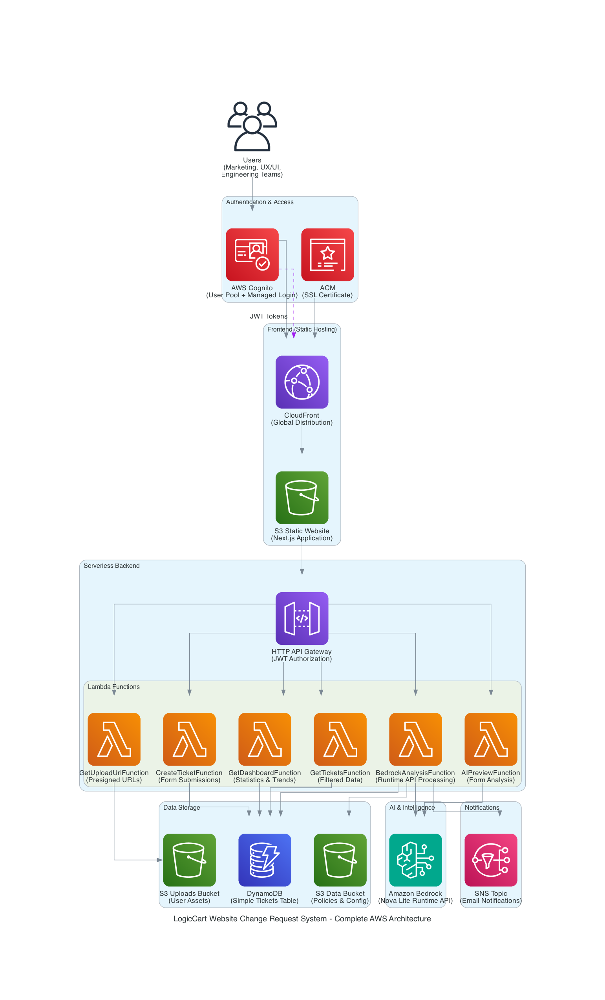

# LogicCart Website Change Request Hub

A modern, AI-powered platform to streamline e-commerce website change requests, built with Next.js, AWS serverless infrastructure, and Amazon Bedrock Runtime API for smart AI validation and decision automation.


## Overview

The **LogicCart Website Change Request Hub** streamlines the process of requesting changes to e-commerce website content with support for both English and Chinese language content. The system handles various change types including New Banner, Copy Updates, New Features, Bug Fixes, and SEO Updates, providing structured intake and dashboard tracking for marketing, UX/UI, and Engineering/DevOps teams.

### Key Problems Solved

- **Eliminates email bottlenecks** with structured digital request forms
- **Standardizes request formats** with validation and required fields  
- **Reduces missing information** through AI-powered analysis and policy compliance checking
- **Provides clear SLAs** with timeline expectations and status tracking
- **Automates approval workflows** with intelligent processing and notifications
- **Quantifies workload** for stakeholders' review


## Features

### 📝 **Submit Request Page**
Structured form for submitting website change requests with AI‑guided validation and required fields.
- **Enhanced AI Preview Analysis** with copy functionality for acceptance criteria
- **Multi-URL support** for batch changes with validation
- **Dual image upload** (Desktop/Mobile) with alt text requirements and direct S3 integration. Uploads must use the exact Content-Type passed during presign; enforced by S3. Image dimensions are measured client-side and sent in the ticket payload.
- **Conditional field display** based on request type
- **Mobile-optimized responsive design** with reduced padding
- **SLA messaging** for timeline expectations
- **Form validation** with accessibility compliance and retry mechanisms

### 🔄 **AI Preview Analysis**
Real‑time detection of missing or incorrect info and automatic policy compliance checks before submission.
- **Real-time form analysis** with missing information detection
- **Policy compliance checking** (Accessibility, Performance, Brand, Design System)
- **Acceptance criteria generation** with copy-to-clipboard functionality
- **Enhanced error handling** with retry mechanism and clear messaging
- **Mobile-optimized sheet layout** with reduced padding
- **Gradient background** with proper visual hierarchy

### 🎉 **Success Page**
Instant confirmation with AI‑generated summary and quick deep‑link back to the dashboard for tracking.
- **Enhanced visual design** with gradient check icon and background
- **AI Summary display** from AI Preview Analysis with session persistence
- **Deep-linking navigation** with "View on Dashboard" button using ticketId parameters
- **Dashboard integration** with automatic row highlighting and smooth scroll-to functionality
- **Edge case handling** with toast notifications when tickets need filtering to locate
- **Compact card design** with hover glow effects
- **Mobile-optimized layout** with proper spacing

### 📊 **Dashboard Page**
Live data view with status filtering, statistics, export, and request history.
- **Live data integration** with real DynamoDB queries and statistics
- **Enhanced statistics cards** with gradient design and trend indicators
- **Advanced data table** with row selection, sorting, and pagination
- **Status filtering** with filter chips (All, Approved, Pending, Completed)
- **Deep-linking support** with automatic row highlighting and smooth scroll-to functionality
- **Edge case handling** with toast notifications ("Ticket created—use filters to locate")
- **CSV/PDF export functionality** with selected row filtering
- **Individual system news accordion cards** with real-time updates
- **Month selector** with automatic updates and trend analysis
- **Mobile-responsive layout** with optimized spacing

### 🔐 **Authentication & Security**
Enterprise‑grade login via AWS Cognito with PKCE flow, JWT authorization, CloudFront route protection, and secure session management.
- **AWS Cognito Integration** with User Pool and Managed Login for enterprise authentication
- **PKCE Flow** with secure authorization code exchange (no client secrets)
- **JWT Authorization** with HTTP API Gateway JWT authorizer for secure API access
- **CloudFront Functions** for route protection with session cookie validation
- **Session Management** with secure token storage and automatic expiration handling

### 🎨 **Design System**
Consistent aurora‑gradient, glassmorphic UI components and mobile‑first layouts for a modern, accessible user experience.
- **Consistent aurora gradient backgrounds** across all pages
- **Glassmorphism effects** and modern card styling
- **Mobile-first responsive design** patterns with touch-friendly interactions
- **Primary purple color scheme** (#5754FF) with consistent branding


## How This Project Leverages AWS Kiro
AWS Kiro was used as a Generative AI assistant to accelerate code scaffolding, validation logic, prompt drafting, and architecture planning.

AWS Kiro was used throughout development to:
- Develop front-end design with Next.js + TailwindCSS + shadcn/ui components
- Enhance overall UX/UI design including Dashboard deep‑linking + export functions, responsive design across devices
- Generate Request Form field validation and dashboard logic
- Plan comprehensive AWS production deployment and generated AWS architecture diagram
- Author Lambda handlers for API Gateway integration + AI preview analysis and decision engine
- Implement security measurements
- Provide clear guidance on front-end and back-end integration


## Implementation Status

### **Frontend Complete**
- Modern Next.js 15 app with form validation, image upload, AI preview, and responsive design
- Dashboard with statistics, data table, news sections, and status filtering
- Submit Request form with enhanced AI Preview Analysis (copy functionality, error handling)
- Enhanced Success page with AI summary display and improved navigation
- CSV/PDF export functionality with selected row filtering
- Deep-linking navigation with row highlighting and scroll-to functionality
- Mobile-responsive design across all pages
- Session storage for submission tracking and AI summary persistence

### **Backend Infrastructure Complete**
- **Lambda functions**: 6 specialized functions
- **HTTP API Gateway** CORS configuration, and secure routing
- **DynamoDB**: Single streamlined tickets table with efficient querying
- **S3 buckets**: Separate buckets for uploads and data with proper security
- **AWS Cognito**: User Pool with Managed Login for authentication

### **Full Integration Complete**
- Frontend successfully connected to deployed AWS backend services
- Real S3 image upload workflow with presigned URLs
- Dashboard displaying live DynamoDB data with filtering and export
- Complete form submission flow with real ticket creation
- Success page deep-linking to dashboard with row highlighting
- Production-ready error handling and validation

### **Production Deployment Complete**
- **Frontend deployed** to S3 + CloudFront with full authentication integration
- **Security implemented**: AWS Cognito authentication with PKCE flow and CloudFront Functions
- **AI Intelligence**: Real-time AI Preview + Lambda functions using Amazon Bedrock Runtime API (Nova Lite)
- **Email notifications**: SNS integration with structured decision reasoning
- **Complete workflow**: Authentication → Form → AI Analysis → Decision → Email → Dashboard


## AWS Architecture



### **Production Architecture**
- **Frontend**: Next.js 15 static export deployed to S3 + CloudFront with authentication
- **Security**: AWS Cognito User Pool + CloudFront Functions + PKCE authentication flow
- **Intelligence**: Real-time AI Preview + Lambda functions with Amazon Bedrock Runtime API (Nova Lite)
- **Backend**: Serverless HTTP API Gateway + 6 specialized Lambda functions
- **Database**: Single streamlined DynamoDB table with efficient querying
- **Storage**: S3 buckets with presigned URL uploads and proper security
- **Notifications**: SNS integration with structured email notifications

### **Lambda Functions Architecture**
- **CreateTicketFunction**: Handles authenticated form submissions with validation
- **GetUploadUrlFunction**: Generates presigned S3 URLs with security validation
- **GetTicketsFunction**: Retrieves filtered ticket lists with user-specific data
- **GetDashboardFunction**: Provides statistics, trends, and recent tickets data
- **AIPreviewFunction**: Real-time form analysis and policy compliance checking
- **BedrockAnalysisFunction**: Intelligent ticket processing and decision automation using Bedrock Runtime API

### **Authentication & Security**
- **AWS Cognito**: User Pool with Hosted UI deployed and operational
- **JWT Authorization**: HTTP API Gateway JWT authorizer validates ID tokens for secure API access
- **CloudFront Functions**: Route protection with session cookie validation
- **PKCE Flow**: Secure authentication without client secrets
- **Session Management**: Secure token storage with deep linking support
- **Production Ready**: Complete authentication system working in production

### **Operational Features**
- **AI Intelligence**: Lambda functions powered by Amazon Bedrock Runtime API (Nova Lite) for automated decision making
- **Email Notifications**: SNS integration with structured decision reasoning
- **Complete Workflow**: Authentication → Form → AI Analysis → Decision → Email → Dashboard

### **Future Enhancements**
- **User Portal**: Individual request detail pages and status updates
- **Admin Portal**: Request review interface, brand asset management, system announcements
- **Advanced Analytics**: Usage metrics, performance monitoring, cost optimization 

### **Streamlined Data Architecture**
```typescript
// Single DynamoDB table with consistent camelCase JSON
interface TicketData {
  ticketId: string          // TKT-20250916123456-abc123 (Partition Key)
  createdAt: string         // ISO-8601 UTC: 2025-09-15T10:00:00Z
  updatedAt: string         // ISO-8601 UTC for tracking changes
  month: string             // YYYY-MM for efficient trend aggregation
  status: 'pending' | 'approved' | 'completed' 
  requesterName: string     // camelCase JSON throughout
  requesterEmail: string    // Used for user-specific filtering
  userId?: string           // Cognito user ID for enhanced security
  // ... other fields in camelCase
}
```
**Benefits**: Single table design reduces complexity, improves performance, and optimizes costs within AWS Free Tier limits.


## Tech Stack

| Category            | Technology                                    |
|---------------------|-----------------------------------------------|
| **Frontend**        | Next.js 15, React 18, TypeScript              |
| **UI Components**   | shadcn/ui, Tailwind CSS, Lucide React         |
| **Form Management** | React Hook Form, Zod                          |
| **Date Handling**   | date-fns, React Day Picker                    |
| **Testing**         | Jest, Testing Library                         |
| **Backend**         | AWS (API Gateway, Lambda, S3, DynamoDB, Bedrock, SNS) |


## Form Fields

### Required Fields
- **Requester Name** – Input field
- **Requester Email** – Valid email format
- **Department** – Dropdown selector from Marketing, UX/UI, or Engineering/DevOps
- **Affected Page Area** – Input field
- **Affected Page URL(s)** – One or add more page URLs
- **Request Type** – Dropdown selector from New Banner, Content Update, New Feature, Bug Fix, SEO Update
- **Target Go-live Date** – Calendar date selection
- **Description** – Expandable textarea

### Optional/Conditional Fields
- **Content Copy/ Description (EN/CH)** – Expandable textarea in separate tabs
- **Image Upload (Desktop / Mobile)** – Includes alt text for each

> ⚠ Conditional logic applies to:
> - Copy and image upload sections shown only when "Request Type" is selected


## Development & Testing

### Setup
```bash
npm install

# Copy environment template and configure your AWS resources
cp .env.example
# Edit .env.local with your actual AWS configuration

npm run dev
```

### Environment Configuration
Create a `.env.local` file with your AWS configuration:
```bash
# API Gateway Configuration
NEXT_PUBLIC_API_BASE=https://your-api-gateway-domain.com/prod
NEXT_PUBLIC_GET_UPLOAD_URL_PATH=/api/upload-url
NEXT_PUBLIC_CREATE_TICKET_PATH=/api/tickets
NEXT_PUBLIC_MAX_UPLOAD_MB=5

# Cognito Authentication Configuration
NEXT_PUBLIC_COGNITO_USER_POOL_ID=your-user-pool-id
NEXT_PUBLIC_COGNITO_CLIENT_ID=your-cognito-client-id
NEXT_PUBLIC_COGNITO_DOMAIN=your-cognito-domain.auth.region.amazoncognito.com

# Site Configuration
NEXT_PUBLIC_SITE_URL=https://your-cloudfront-domain.cloudfront.net
```


### Get Started
Navigate to [http://localhost:3000](http://localhost:3000) to view the application.

### Static Build for S3 Export
```bash
npm run build        # Generates static export in ./out directory
```

The build command produces a static export in the `./out` directory, ready for S3 deployment. Static export is configured via `output: 'export'` in `next.config.mjs`.


### Testing Coverage:
- Jest and Testing Library setup for unit testing
- Accessibility compliance testing
- Form validation and calendar functionality testing
- Cross-browser compatibility and responsive design testing
- AI Preview error handling and retry mechanism testing
- Dashboard navigation and export functionality testing


## Routes

- **`/`** - Main form for creating change requests with AI Preview Analysis (requires authentication)
- **`/auth/start`** - Authentication initiation with PKCE flow (invisible redirect)
- **`/auth/callback`** - Authentication callback handler with token exchange
- **`/success`** - Enhanced confirmation page with AI summary and navigation (authenticated)
- **`/dashboard`** - Comprehensive dashboard with statistics, filtering, and export (authenticated)

**Authentication Flow (Production):**
1. Unauthenticated users are redirected to `/auth/start`
2. PKCE flow redirects to AWS Cognito Hosted UI
3. Successful authentication returns to original destination with secure tokens
4. CloudFront Functions protect all routes with session validation
5. Deep linking preserved through authentication process


## Project Structure

```
src/
├── app/                    # Next.js App Router pages
│   ├── globals.css        # Global styles and CSS variables
│   ├── layout.tsx         # Root layout with sidebar and header
│   ├── page.tsx           # Submit Request form page
│   ├── dashboard/         # Dashboard page
│   │   └── page.tsx       # Enhanced dashboard with statistics and data table
│   └── success/           # Success confirmation page
│       └── page.tsx       # Request submission confirmation with AI summary
├── components/
│   ├── ui/                # shadcn/ui components (enhanced)
│   │   ├── table.tsx      # Data table with selection
│   │   ├── accordion.tsx  # News accordion cards
│   │   ├── checkbox.tsx   # Square checkboxes with rounded corners
│   │   └── ...            # Other shadcn/ui components
│   ├── dashboard/         # Dashboard-specific components
│   │   ├── DashboardHeader.tsx      # Header with month selector and export
│   │   ├── StatisticsCards.tsx      # Gradient statistics with trends
│   │   ├── RecentRequestsTable.tsx  # Data table with selection and row highlighting
│   │   ├── StatusFilterChips.tsx    # Status filtering chips
│   │   ├── NewsSection.tsx          # Individual accordion cards
│   │   ├── ExportButton.tsx         # CSV/PDF export functionality
│   │   ├── LoadingSkeletons.tsx     # Loading states
│   │   └── ErrorStates.tsx          # Error handling components
│   ├── Header.tsx         # Mobile-optimized header with centered favicon
│   ├── Sidebar.tsx        # Navigation with active states
│   ├── MainContent.tsx    # Content wrapper with responsive padding
│   ├── UrlList.tsx        # Multi-URL input component
│   ├── DualImageDropzone.tsx # Desktop/Mobile image upload
│   ├── AIPreviewSheet.tsx # AI analysis slide-over sheet with copy functionality
│   └── AIRecap.tsx        # AI summary display component for success page
├── contexts/
│   └── SidebarContext.tsx # Sidebar state management
└── lib/
    ├── api/               # API client and types (ready for backend)
    ├── dashboard/         # Dashboard-specific utilities
    │   ├── types.ts       # TypeScript interfaces
    │   ├── mock-data.ts   # Mock data (ready for API replacement)
    │   ├── export-utils.ts # CSV/PDF export functionality
    │   ├── date-utils.ts  # Month handling and auto-updates
    │   └── useDashboardData.ts # Data fetching hook
    └── utils.ts           # Utility functions
```


## Accessibility Features

- Proper semantic HTML structure with ARIA labels and descriptions
- Focus management (success page heading receives focus)
- Keyboard navigation support for all interactive elements
- Minimum 44px tap targets for mobile touch interactions
- Error messages linked to form fields via `aria-describedby`
- Screen reader support for dynamic content updates
- High contrast mode compatibility
- Copy functionality with keyboard shortcuts and screen reader announcements


## Security & Performance

### **Frontend Security**
- Input validation with Zod schemas
- XSS prevention with proper escaping
- File upload validation (size, type, dimensions)
- Session storage (not localStorage) for sensitive data

### **Backend Security**
- **Authentication**: AWS Cognito User Pool with Managed Login for enterprise-grade security
- **JWT Authorization**: HTTP API Gateway JWT authorizer validates Cognito ID tokens for all API endpoints
- **User Management**: Cognito handles user lifecycle, password policies, and MFA
- **Input sanitization and validation** with comprehensive error handling
- **File upload security** via type validation, size/dimension checks, and presigned URLs
- **Rate limiting** for API endpoints with AWS-managed throttling
- **CORS configuration** for frontend domain (enforced by S3 and API Gateway)

### **Performance Optimizations**
- Static export configuration for fast loading
- Image optimization with size/dimension validation
- Lazy loading for dashboard components
- Efficient re-rendering with React.memo
- Debounced search and filtering
- Client-side CSV/PDF generation to reduce server load


## Deployment

### **Caching Strategy**
- **HTML (*.html)**: `Cache-Control: no-cache, no-store, must-revalidate`
- **Static assets** (hashed JS/CSS/img): Long max-age (e.g., 1 year)

### **CloudFront Configuration**
- Viewer protocol policy: Redirect HTTP to HTTPS
- Custom error responses (403/404 → /index.html, 200)
- Brotli/Gzip compression enabled

### **End-to-End Testing Checklist**
- Upload → create ticket → S3 object present → DynamoDB item present → success page deep-link → dashboard highlight


## Demo Site: Access for Judges Only

This project has a fully functional prototype demo deployed via S3 and CloudFront. Access is restricted to AWS AI Hackathon Hong Kong judges only. Please refer to the submission portal for the access link and credentials.


## License

MIT License © 2025 Stacy Po
